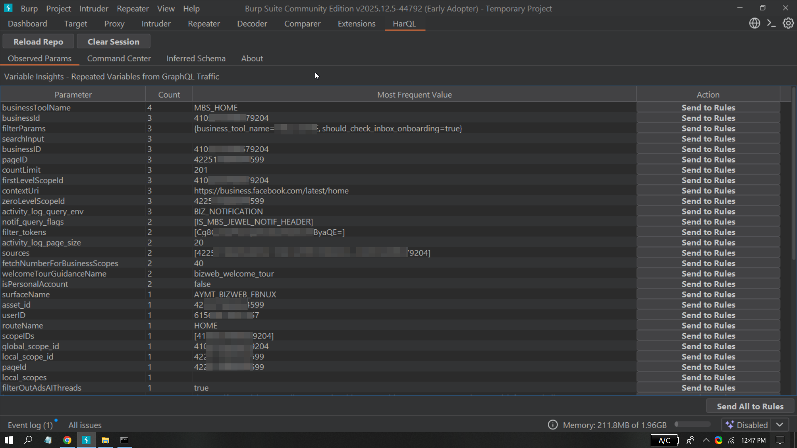
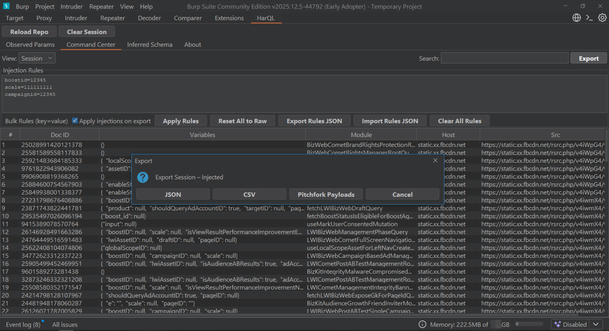
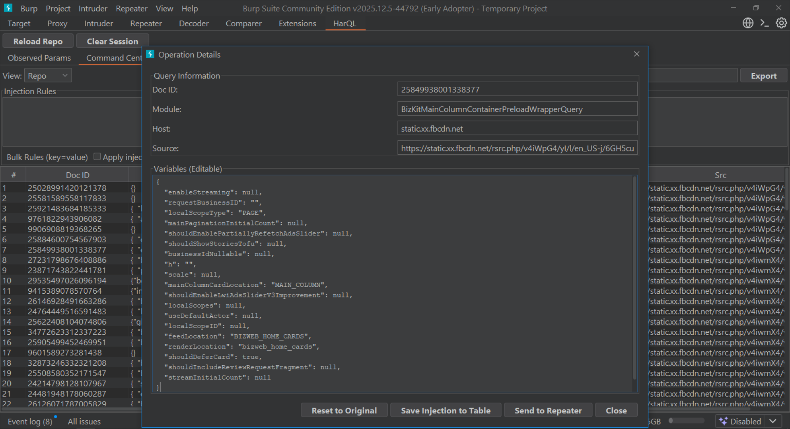
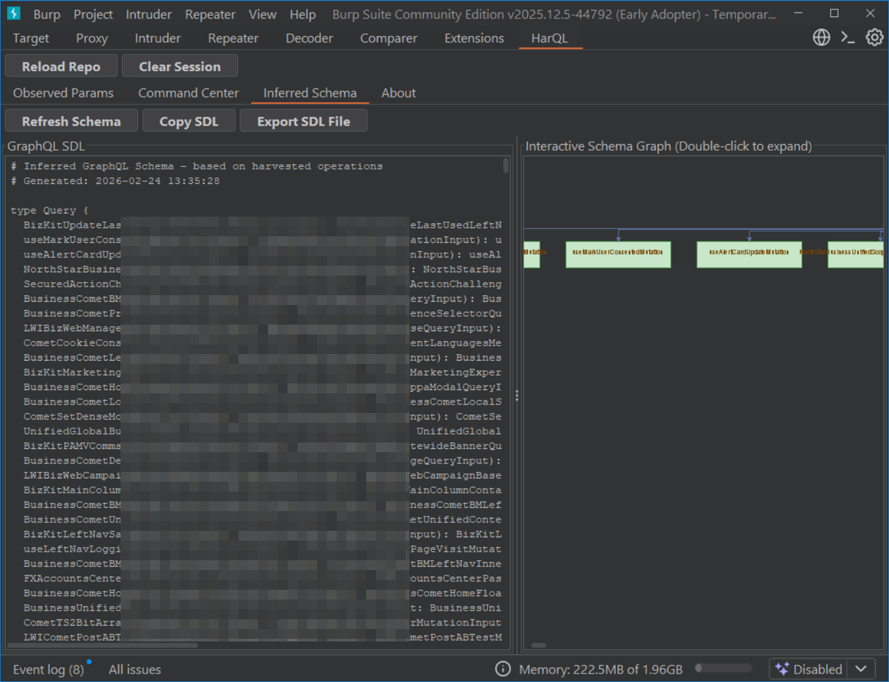
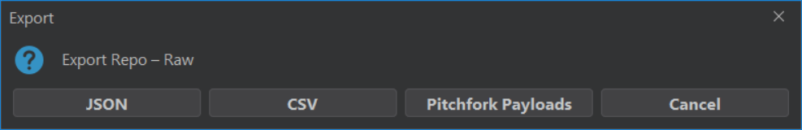
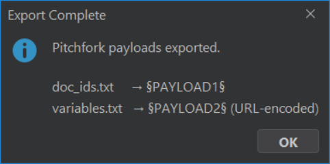

### HarQL

GraphQL Operation Harvester for Burp Suite

HarQL is a Burp Suite extension designed to extract GraphQL operations, doc_ids, and associated variables from JavaScript bundles and observed HTTP traffic.

The extension operates entirely in memory and does not rely on GraphQL introspection, making it suitable for environments where introspection is disabled or restricted.

HarQL is optimized for large-scale production GraphQL deployments, including applications that use obfuscated JavaScript bundles and modular client architectures.

---

## Key Features

Introspection-Independent Operation Extraction — Works regardless of schema introspection availability

Advanced JavaScript Bundle Parsing — Extracts operations from large and obfuscated JS files

Real-Time Traffic Harvesting — Identifies GraphQL requests during live browsing

Injection Rules System — Bulk rule management using key=value patterns with instant apply/reset

Observed Variables Insight — Detects and ranks frequently occurring parameters across operations

Inferred Schema Generation — Builds an SDL representation with interactive graph visualization

One-Click Send to Repeater — Reconstructs complete GraphQL requests with correct doc_id, variables, and operation metadata

Multiple Export Formats — JSON, CSV, and Pitchfork-compatible payloads

Session & Repository Management — Persistent storage with autosave and live session tracking

---

## Demo & Screenshots

### 1. Variable Insights – Repeated Variables Ranking


### 2. Command Center + Bulk Injection Rules + Export Menu


### 3. Operation Details + One-Click Send to Repeater


### 4. Inferred Schema + Interactive Graph


### 5. Export Options – Raw Repo


### 6. Pitchfork Export Success


---

## Installation

### Manual Installation

1. Clone the repository:
   ```bash
   git clone https://github.com/HasanHabeeb/HarQL
   cd HarQL
   gradle clean build

Build the extension:Bashgradle clean build
The compiled JAR will be available in build/libs/
In Burp Suite:
Go to Extensions → Installed → Add
Select the generated .jar file
Restart Burp Suite (recommended)

---

## Usage

Load HarQL in Burp Suite

Browse the target application normally

HarQL automatically harvests GraphQL operations from:

JavaScript responses

Live HTTP traffic

---

## Tabs Overview : 

Observed Params — Displays repeated variables and allows direct rule creation

Command Center — Manage harvested operations, variables, and injection rules

Inferred Schema — View generated SDL and interactive graph

---

## Architecture Overview : 

HarQL uses a hybrid harvesting approach:

Static analysis of JavaScript modules

Dynamic inspection of live GraphQL traffic

In-memory structured storage for high performance

Recursive variable flattening and rule application engine

All processing is performed locally within Burp Suite.

---

## Performance & Resource Management : 

Configurable maximum JavaScript module size

Background processing to avoid UI thread blocking

In-memory repository optimized for large operation sets

Designed to minimize CPU and memory overhead

---

## Security & Compliance : 

HarQL is intended for authorized security testing and research purposes only.

The extension does not bypass authentication, access control, or server-side authorization mechanisms.
It extracts GraphQL operations and parameters that are already present in client-side resources or observed HTTP traffic.

No external network communication
No telemetry or data collection
No third-party remote dependencies
All analysis performed locally
Technical Compliance
Implemented in Java
Built using the official Burp Extender API
Fully self-contained JAR
No external runtime dependencies
Proper extension unloading implementation
Compatible with Burp Suite Community and Professional editions

---
## License

This project is licensed under the MIT License.

---

## Author

Hasan Habeeb 

Offensive Security Researcher

Email: Xvisor03@gmail.com

LinkedIn: https://linkedin.com/in/hasanhabeeb

GitHub: https://github.com/Hasnhab

---
## Made with passion for the bug bounty and offensive security community.
